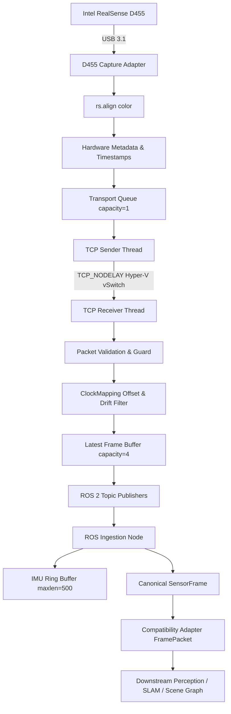

# Stage 1: Data Acquisition and Ingestion Architecture

## 1. System Overview & Deployment Topology

The Dynamic 3D Scene Graph product operates on a hybrid distributed topology:
- **Physical Sensor:** Intel RealSense D455 active stereo camera connected via USB 3.1 to a Windows host.
- **Windows Host Runtime:** Runs native RealSense acquisition (`tools/d455_sender.py`) extracting color, aligned depth, 6-axis IMU, factory intrinsics, and hardware timestamps.
- **Transport Bridge:** Streams serialized Stage 1 packets over TCP socket via Hyper-V virtual switch to WSL2.
- **WSL2 Runtime:** Runs Ubuntu 22.04 LTS and ROS 2 Humble. The bridge receiver (`d455_receiver.py`) validates packets, performs online clock offset mapping, and publishes ROS sensor topics to the scene graph ingestion node (`scene_graph_node.py`).

## 2. Core Architectural Invariants

- **INVARIANT 1 (Canonical Depth):** Canonical depth in `SensorFrame` is strictly `float32` metric depth in meters. Integer raw scaling occurs exactly once in the sensor adapter.
- **INVARIANT 2 (Provenance):** Canonical sensor timestamps preserve original source clock domains without destructive flattening.
- **INVARIANT 3 (Domain Separation):** Incompatible clock domains (`HARDWARE_CLOCK`, `SYSTEM_TIME`, `SIMULATED_TIME`) cannot be directly compared or subtracted without an explicit mapping.
- **INVARIANT 4 (Session Continuity):** Sequence numbers are monotonic within a sensor session. Reconnecting the camera or sender resets the session ID and clock mapping.
- **INVARIANT 5 (Hardware Synchronization):** RGB and depth stream synchronization uses source sensor timestamps, rejecting pairs exceeding the 50 ms tolerance.
- **INVARIANT 6 (Acquisition Decoupling):** Camera acquisition runs on an independent thread and never blocks behind network transmission, disk I/O, or downstream inference.
- **INVARIANT 7 (Bounded Memory):** All queues and ring buffers are strictly bounded (`maxlen=1`, `maxlen=4`, `maxlen=500`). Unbounded growth is prohibited.
- **INVARIANT 8 (Fault Isolation):** A malformed TCP packet, camera dropout, or network disconnection cannot crash the process.
- **INVARIANT 9 (Fault Decoupling):** A localization failure (e.g. SLAM tracking loss) does not invalidate sensor acquisition or crash ingestion.
- **INVARIANT 10 (Hardware Truth):** Calibration and depth scale are queried directly from the active RealSense profile, not hardcoded.
